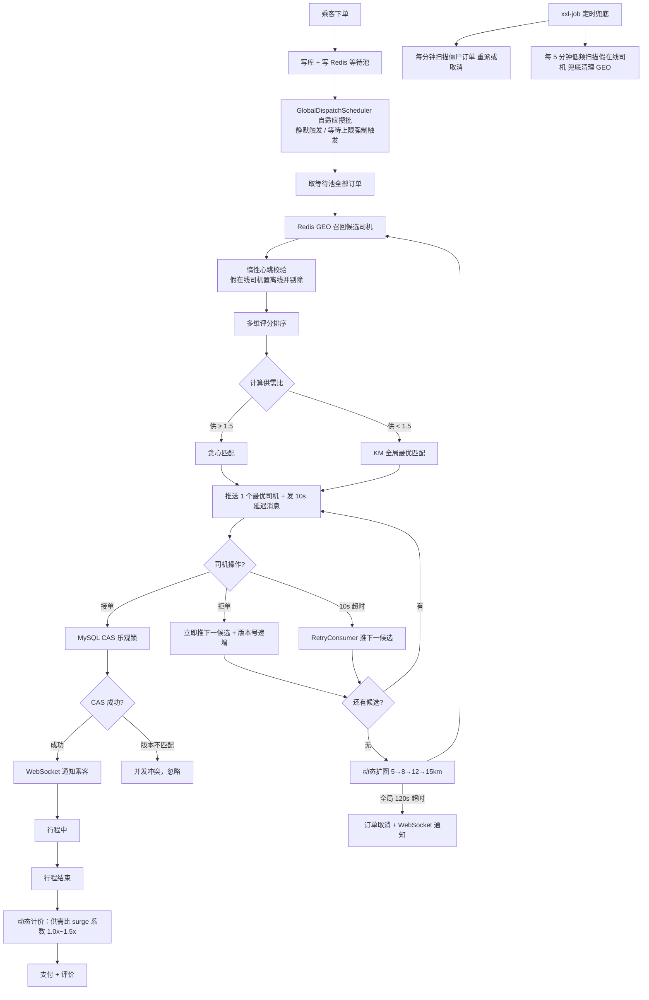

<div align="center">
  <h1>🚗 OpenRide — 高并发网约车智能调度与派单系统</h1>

  <p align="center">
    <strong>自适应 KM 全局匹配 · 异步调度引擎 · 乐观锁并发控制 · 漂移检测状态机 · WebSocket 实时推送</strong>
  </p>

  <p align="center">
    
    
    
    
    
    
    
    
  </p>
</div>

<br/>

## 📖 项目简介

一个完整的网约车后端系统，包含**乘客端、司机端**双端 Web 应用。实现了乘客下单 → 智能派单调度 → 司机接单 → 行程跟踪 → 动态计价 → 支付评价的**完整业务闭环**。

系统围绕**高并发、高可用、数据一致性**三个核心目标设计：通过 Redis GEO 实现毫秒级司机召回，基于供需比自适应选择贪心或 KM 全局最优匹配策略，结合 RabbitMQ 延迟消息实现多轮候选中转，通过 MySQL 乐观锁保证接单幂等，并以 xxl-job 定时任务作为兜底补偿，构建了 **MQ 主链路 + 定时兜底**的双保险可靠性体系。

<br/>

## 🔥 核心亮点

### 1. 自适应派单策略：贪心 + KM 全局最优匹配

**问题**：传统"一单一派"模式在司机稀缺、多订单集中到达时会出现局部最优、全局较差的问题——先派出去的订单抢走了后派订单的唯一合适司机。

**方案**：引入基于实时供需比的自适应派单策略：

- 订单不再直接入队派发，而是先写入 **Redis ZSET 等待池**（`order:waiting:pool`），由 `GlobalDispatchScheduler` 自适应攒批后统一取出批量处理（攒批触发机制见亮点 2）；
- 计算实时**供需比** = 所有订单候选司机并集去重数 / 订单数；
- **供给充足（供需比 ≥ 1.5）**：采用贪心策略，按订单优先级降序，依次取评分最高且未被分配的司机，快速响应；
- **供给紧张（供需比 < 1.5）**：将订单与候选司机建模为加权二部图，以调度评分（距离 40% + 接单率 30% + 空闲时长 20% + 近期派单惩罚 10%）为边权，通过 **Kuhn-Munkres（KM）算法求解全局最大权匹配**，最大化总成交率。

```
候选司机召回 → 多维评分排序 → 供需比判断 → 贪心 / KM 匹配 → 每单推送 1 个最优司机
```

### 2. 异步调度引擎：等待池 + 自适应攒批 + 延迟轮转

**问题**：下单接口需要快速响应，而司机召回、评分计算、匹配推送是耗时操作，同步处理会阻塞用户请求；同时若采用固定周期批处理，同一波峰到达的订单会被周期边界切进两个批次——先处理的批次抢走最优司机，全局匹配退化为多次局部最优。

**方案**：将下单与派单流程彻底解耦，构建异步调度引擎：

- **解耦架构**：乘客下单仅写库 + 写入 Redis 等待池即返回，核心派单逻辑异步完成；
- **自适应攒批触发（防抖 + 等待上限）**：`GlobalDispatchScheduler` 以订单到达节奏驱动攒批——窗口内持续有新订单到达就继续等待，让同一波峰的订单进入同一轮全局匹配；直到出现静默间隙（不再有新订单到达）或攒批时长触达等待上限才触发派单，统一完成 GEO 召回 → 评分 → 匹配 → 推送的全流程。突发流量下 KM 能看到完整订单集合，匹配质量最大化；低峰期单笔订单只等一个静默窗口即派出，延迟反而更低；等待上限则保证高峰期首单延迟有硬上界（类似 Kafka `linger.ms` 的攒批思想）；
- **多轮候选中转**：每单只推送 1 个最优司机（推送 key TTL=20s），同时发送 10s 延迟消息到 `dispatch.retry.queue`；超时未接单则 `RetryConsumer` 取候选列表中的下一位司机继续推送，候选耗尽则自动扩圈（5 → 8 → 12 → 15km）重新召回；
- **版本号幂等**：每次推送生成递增版本号（`order:dispatch:version:{orderId}`），延迟消息携带版本号，消费时校验一致性，防止旧消息覆盖新推送状态；
- **司机拒单**：拒单接口立即同步推送候选列表中下一司机，不等延迟消息到期，缩短乘客等待时间；
- **全局超时**：120 秒仍未接单则发消息到 `cancel.queue`，自动取消订单并通知乘客。

### 3. 并发接单控制：CAS 乐观锁 + Redisson 分布式锁

**问题**：派单采用串行轮转，每次只推一位司机。但由于推送 key TTL（20s）略长于延迟消息（10s）给重试留缓冲，极端情况下超时司机与当前司机可能并发接单；同时 MQ 消息存在重复投递风险。

**方案**：明确划分两类并发场景，使用不同的控制手段：

- **接单一致性（MySQL CAS 乐观锁）**：`UPDATE order SET status='ACCEPTED', driver_id=?, version=version+1 WHERE id=? AND status='DISPATCHING' AND version=?`——仅第一个到达的请求更新成功（affected rows=1），后续请求因 version 不匹配而失败，保证同一订单不会被重复接单。选择 CAS 而非分布式锁的原因：接单是低频写操作，乐观锁冲突率低；MySQL 是最终数据源，直接 CAS 避免了"锁成功但写库失败"的不一致。
- **消费幂等（Redisson 分布式锁）**：`tryLock("lock:dispatch:" + orderId)` 防止 MQ 消息被多个消费者实例并发处理同一订单；`tryLock("lock:dispatch:tick")` 防止多实例同时执行 tick 调度；`tryLock("lock:compensate:" + orderId)` 防止 xxl-job 多节点重复补偿同一订单。

```
职责边界：CAS 负责业务一致性（接单防重），Redisson 负责协调型并发（消费幂等）
```

### 4. 位置数据质量治理：漂移检测状态机 + 乱序过滤 + 假在线惰性检测

**问题**：司机端每 5 秒上报一次位置，高频写入带来三类数据质量问题——网络乱序包、GPS 漂移点、假在线司机。

**方案**：构建完整的位置数据质量治理体系：

- **乱序过滤**：每次上报携带客户端时间戳，后端与 Redis 中上次处理时间戳比较，时间戳不严格递增则直接丢弃，防止网络乱序包污染 GEO 数据；
- **漂移检测状态机**：使用 Haversine 公式计算相邻两次上报的球面距离，5s 内位移超过 200m 判定为漂移点。引入滑动候选坐标（`candidate`）解决早期版本在司机持续移动后陷入"永远无法恢复"的死锁问题——进入 DRIFTING 态后，第一个合理点存入 `candidate`，后续点与 `candidate` 互比；连续两个相邻点距离合理则恢复 NORMAL 态，再次跳变则 `candidate` 滑动到当前点重新积累。
- **假在线检测（惰性检测为主 + 低频扫描兜底）**：司机每次上报位置时刷新心跳 key（TTL=30s），检测策略完整借鉴 **Redis 过期键「惰性删除 + 定期删除」**的组合思想。**惰性检测（主路径）**：每次派单、构建候选队列前校验候选司机的心跳 key，已过期则判定为假在线，当场从 GEO 集合移除、数据库状态置为离线并剔除出候选列表——校验发生在派单时刻，保证被推送的司机心跳一定新鲜，检查成本也从高频周期扫描的 O(全体在线司机) 降为 O(候选集) 的按需校验；**低频扫描（兜底）**：纯惰性检测存在「无人使用就无人清理」的盲区，长期无单区域的假在线司机会一直残留在 GEO 集合，因此保留 xxl-job 每 5 分钟一次的低频全量扫描补位清理，以极低的扫描频率换取完整覆盖。

### 5. 实时通信：WebSocket 推送 + 轮询兜底混合方案

**问题**：司机端需要通过轮询获取新订单，存在延迟（轮询间隔 = 感知延迟）；乘客端需要实时感知订单状态变化。

**方案**：设计 WebSocket + 轮询混合通信方案：

- **WebSocket 定向推送**：派单、接单成功、拒单、订单取消等**离散事件**通过 WebSocket 实时推送给目标用户，消除轮询延迟；
- **轮询兜底**：位置更新、行程状态变化等**连续状态**保留轮询机制作为 WebSocket 断线时的兜底方案；
- **会话管理**：`WebSocketSessionManager` 维护 userId → WebSocket session 映射，支持定向消息推送和会话生命周期管理。

```
WebSocket 负责事件通知（低延迟），轮询负责状态同步（高可靠），两者互补保障端侧状态最终一致
```

<br/>

## 📐 系统架构



<br/>

## 🛠 技术栈

| 层次 | 技术 | 说明 |
| :--- | :--- | :--- |
| 后端框架 | Spring Boot 3.5 · Java 17 | 主框架 |
| 持久层 | MySQL 8.0 · MyBatis-Plus | 业务数据存储 + 乐观锁插件 |
| 缓存 / 地理位置 | Redis GEO · Redisson | 司机定位召回 + 分布式锁 + 业务缓存 |
| 消息队列 | RabbitMQ（延迟消息插件） | 异步派单 + 多轮超时重试 + 死信兜底 |
| 定时任务 | xxl-job 2.4.x | 僵尸订单兜底补偿 + 假在线司机低频兜底清理 |
| 实时通信 | WebSocket（Spring WebSocket） | 派单/接单/拒单事件实时推送 |
| 算法 | Kuhn-Munkres（KM） | 司机稀缺场景全局最优匹配 |
| 前端 | 原生 HTML/CSS/JS + 高德地图 SDK | 双端 Web 应用 |

<br/>

## 🚀 快速开始

### 方式一：Docker Compose 一键部署（推荐）

> **更简单**：直接运行 `bash setup.sh`，脚本会自动完成以下全部步骤。

```bash
# 1. 克隆项目
git clone https://github.com/CNIronBro/OpenRide

# 2. 一键启动所有中间件（首次启动自动建库建表）
docker-compose up -d

# 3. 初始化 xxl-job 调度中心表结构（仅首次需要）
# 下载官方建表 SQL：
# https://github.com/xuxueli/xxl-job/blob/master/doc/db/tables_xxl_job.sql
docker exec -i didi-mysql mysql -uroot -proot xxl_job < tables_xxl_job.sql

# 等待所有容器 healthy 后，启动应用
# 4. 启动 Spring Boot 应用（终端 2）
mvn clean spring-boot:run

# 5. 配置 xxl-job 任务（见下方「xxl-job 任务配置」节）

# 6. 访问页面
#    乘客端：    http://localhost:8080/passenger/index.html
#    司机端：    http://localhost:8080/driver/index.html
#    RabbitMQ：  http://localhost:15672                     （guest / guest）
#    xxl-job：   http://localhost:8090/xxl-job-admin        （admin / 123456）
```

> **说明**：`docker-compose up -d` 启动后，MySQL 容器会自动执行 `src/main/resources/db/init.sql` 建表，Redis 和 RabbitMQ 开箱即用。RabbitMQ 已通过自定义 Dockerfile 预装 `rabbitmq-delayed-message-exchange` 插件，无需手动安装。

### 方式二：手动部署

| 组件 | 版本 | 端口 |
| :--- | :--- | :--- |
| JDK | 17+ | — |
| MySQL | 8.0 | 3309 |
| Redis | 6.2+ | 6379 |
| RabbitMQ | 3.9+（需安装 `rabbitmq-delayed-message-exchange` 插件） | 5672 / 15672 |
| xxl-job-admin | 2.4.x | 8090 |

```bash
# 1. 创建数据库并导入表结构
mysql -u root -p -e "CREATE DATABASE IF NOT EXISTS didi DEFAULT CHARACTER SET utf8mb4;"
mysql -u root -p didi < src/main/resources/db/init.sql

# 2. 修改 src/main/resources/application.yml 中的连接配置

# 3. 启动
mvn clean spring-boot:run
```

<br/>

## 📂 项目结构

```
src/main/java/com/ironbro/didi/
├── common/          # 通用组件：统一响应 Result、业务异常 BizException、会话工具 SessionUtils
├── config/          # 配置类：MybatisPlus（分页+乐观锁插件）、RabbitMQ（队列/交换机声明）、WebSocket
├── controller/      # HTTP 入口层（薄层），双端 API 控制器
├── service/         # 业务逻辑层
│   └── dispatch/    # 派单调度子模块：GlobalDispatchScheduler、KuhnMunkresAlgorithm、DispatchWaitingPool
├── mq/              # RabbitMQ 消费者：RetryConsumer、CancelConsumer
├── entity/          # MyBatis-Plus 实体（Order 含 @Version 乐观锁字段）
├── mapper/          # MyBatis-Plus BaseMapper
├── enums/           # 业务枚举：OrderStatus、DriverStatus、UserRole 等
└── websocket/       # WebSocket：WsMessage、RideWebSocketHandler、WebSocketSessionManager
```

<br/>

## 🎯 xxl-job 任务配置

项目启动后，需在 xxl-job 调度中心（`http://localhost:8090/xxl-job-admin`）中配置以下任务：

| 任务 | Cron | 说明 |
| :--- | :--- | :--- |
| compensateDispatchingOrders | `0 * * * * ?` | 每分钟扫描僵尸订单，重新派单或取消 |
| cleanFakeOnlineDrivers | `0 */5 * * * ?` | 每 5 分钟低频兜底扫描残留假在线司机（主路径为派单时惰性检测） |

> 执行器 appname 需配置为 `didi-executor`，与 `application.yml` 中 `xxl.job.executor.appname` 一致。

<br/>

## 📄 License

MIT License — 本项目仅用于学习与面试展示，不用于商业用途。