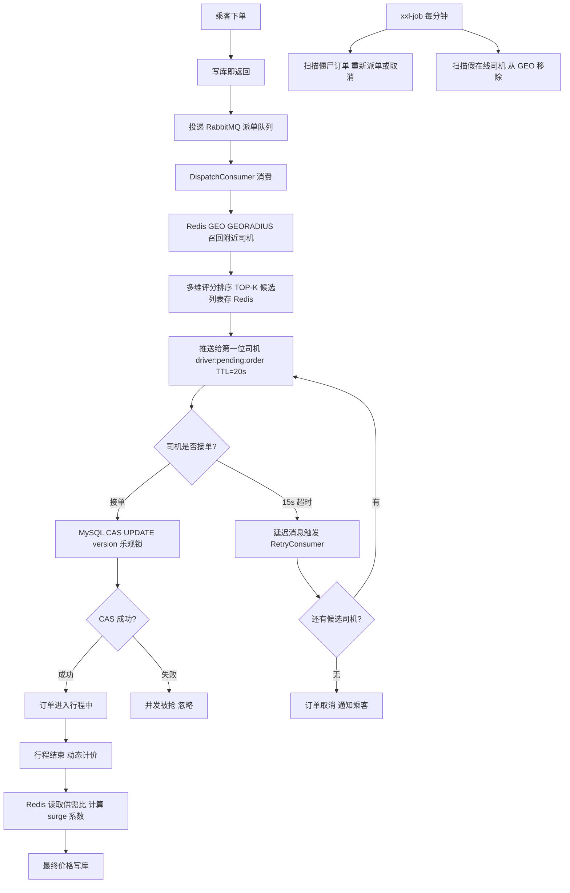

<div align="center">
  <h1 align="center">高并发网约车调度与派单系统</h1>

  <p align="center">
    <strong>Redis GEO 召回 / RabbitMQ 异步派单 / MySQL CAS 接单一致性 / xxl-job 兜底补偿</strong>
  </p>

  <p align="center">
    
    
    
    
    
  </p>
</div>

<br/>

面向司机和乘客的网约车服务平台，包含司机端、乘客端和管理员端三端，实现了乘客下单、附近司机召回与智能调度派单、司机抢单、全程行程跟踪到行程结束动态计价的完整业务闭环。

<br/>

## 核心亮点

**1. Redis GEO 召回 + 多维评分调度派单**

乘客下单后，写库即返回，GEO 召回与评分排序通过 RabbitMQ 异步完成，避免同步阻塞下单接口。召回利用 Redis GEO（底层基于 Sorted Set + Geohash）的 `GEORADIUS` 命令在 O(N+logM) 时间内获取指定半径内的在线司机候选列表，相比 MySQL Haversine 公式查询性能显著更优。召回后不直接按距离派单，而是引入多维调度评分模型（距离 40%、接单率 30%、空闲时长 20%、近期被派次数惩罚 10%），综合排序后依次推送，兼顾效率与公平性。候选列表和当前派单下标均存入 Redis，配合 RabbitMQ 延迟消息实现 15s 超时自动轮转下一位司机，候选耗尽则自动取消并通知乘客。针对商圈与郊区司机密度差异较大的问题，设计动态扩圈召回策略，提升派单覆盖率与成功率。

**2. MySQL 乐观锁（CAS）保证接单幂等一致性**

派单采用串行轮转策略，每次只推送给一位司机。但由于司机端通过轮询获取订单，推送 key 的 TTL（20s）刻意长于派单延迟（15s），目的是给 RetryConsumer 处理和推送下一位司机留出缓冲时间——这个 TTL 窗口导致极端情况下前一位超时司机与当前司机可能并发接单。为此通过 `order` 表的 `version` 字段实现乐观锁：`UPDATE \`order\` SET status='ACCEPTED', driver_id=?, version=version+1 WHERE id=? AND status='DISPATCHING' AND version=?`，仅第一个到达的请求能更新成功，保证订单不会被重复接单。Redisson 分布式锁仅用于派单消费幂等（防止 MQ 消息被多个消费者实例并发处理同一订单），职责边界清晰。

**3. xxl-job 兜底补偿，构建双保险可靠性链路**

MQ 主链路存在消息丢失、消费者崩溃等极端故障场景，且 MQ 无法主动扫描存量异常数据。为此引入 xxl-job 作为兜底：每分钟扫描数据库中 `status=DISPATCHING` 且 `updated_at < NOW()-5min` 的僵尸订单，结合 Redisson tryLock 防止多节点重复补偿，重新触发派单或直接取消；另设每 30s 的心跳扫描任务，清理 Redis 心跳 key 已过期的假在线司机，从 GEO 集合移除并更新状态。MQ 负责实时高效的主链路，xxl-job 负责定期可靠的兜底，两者形成互补的双保险机制。

**4. 基于供需比的动态计价**

行程结束时，从 Redis 读取当前区域的实时订单量与空闲司机量（均设 5min TTL 缓存），计算供需比 `surge_ratio = 区域订单数 / 空闲司机数`，映射为 1.0x～1.5x 的调价系数，最终价格 = 基础计价（起步价 + 里程费 + 时长费）× surge 系数。Redis 缓存避免了每次计价都查库，surge 系数上限 1.5x 防止极端情况下价格失控。

**5. 司机位置数据质量治理：乱序过滤 + 漂移检测状态机 + 假在线清理**

司机端每 2s 上报一次位置，高频写入带来三类数据质量问题：乱序包、GPS 漂移点、假在线司机。

- **乱序过滤**：每次上报携带客户端时间戳，后端与 Redis 中记录的上次处理时间戳比较，时间戳不严格递增则直接丢弃，防止网络乱序包污染 GEO 数据。
- **漂移检测状态机（V5）**：使用 Haversine 公式计算相邻两次上报的球面距离，2s 内位移超过 200m（约 360km/h）判定为漂移点。引入滑动候选坐标（`candidate`）解决早期版本中司机持续移动后陷入永远无法恢复的死锁问题：进入 DRIFTING 态后，第一个合理点存入 `candidate`，后续点与 `candidate` 互比；若连续两个相邻点距离合理则恢复 NORMAL 态，若再次跳变则 `candidate` 滑动到当前点重新积累。整个状态机仅用三个 Redis key 驱动，无数据库依赖。
- **假在线检测**：司机每次上报位置时刷新心跳 key（TTL=30s），xxl-job 每 30s 扫描一次，心跳 key 已过期则判定为假在线，从 GEO 集合移除并将数据库状态置为离线。

**6. GPS 点平滑行驶动画**

接入高德地图路线规划 API，按接客/送客两阶段分别规划路线；针对车辆轨迹动画难以还原转弯路径的问题，通过距离游标 + 分段插值算法计算车辆位置，实现平滑连续的行驶动画效果。

<br/>

## 技术栈

| 层次 | 技术 |
| :--- | :--- |
| 后端框架 | Spring Boot 3.5 · Java 17 |
| 持久层 | MySQL 8.0 · MyBatis-Plus |
| 缓存 / 地理位置 | Redis GEO · Redisson |
| 消息队列 | RabbitMQ（TTL + DLX） |
| 定时任务 | xxl-job |
<br/>

## 系统流程



<br/>

## 本地部署

### 环境要求

| 组件 | 版本 |
| :--- | :--- |
| JDK | 17+ |
| MySQL | 8.0 |
| Redis | 7.x |
| RabbitMQ | 3.x（需安装 `rabbitmq-delayed-message-exchange` 插件） |
| xxl-job | 2.4.x |

### 数据库初始化

```bash
# 建表 SQL
mysql -u root -p didi < src/main/resources/db/init.sql
```

### 配置修改

编辑 `src/main/resources/application.yml`，按实际环境修改以下配置：

```yaml
spring:
  datasource:
    url: jdbc:mysql://localhost:3309/didi
    username: root
    password: your_password

  data:
    redis:
      host: localhost
      port: 6379

  rabbitmq:
    host: localhost
    port: 5672

admin:
  username: admin
  password: your_admin_password
```

### 启动项目

```bash
mvn clean spring-boot:run
```
<br/>

## 贡献与支持

如果这个项目对你有帮助，欢迎给个 Star ⭐